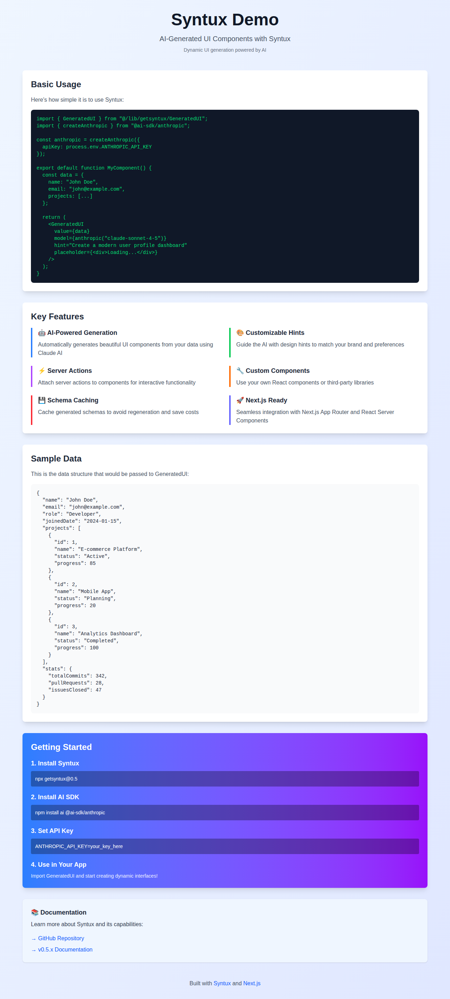

# Syntux Demo - AI-Generated UI Components

*2026-02-12T23:05:45Z*

This demo showcases the **Syntux** library (v0.5.x) - an AI-powered UI generation tool for Next.js applications.

Syntux automatically generates beautiful React components from your data structures using Claude AI. Simply pass your data and a design hint, and Syntux creates a custom UI on the fly.

## What is Syntux?

Syntux is a library that integrates with Next.js to provide AI-generated UI components. It uses the Vercel AI SDK and Claude AI to:
- Automatically generate UI from data structures
- Apply custom styling based on design hints
- Support server actions for interactive functionality
- Enable custom React components
- Cache generated schemas for performance

## Live Demo

This repository contains a working demonstration of Syntux integrated into a Next.js application.


## Installation Steps

Follow these steps to set up Syntux in your Next.js project:

```bash
echo 'Step 1: Install Syntux library (v0.5.x)' && npx getsyntux@0.5 --help 2>&1 | head -20
```

```output
Step 1: Install Syntux library (v0.5.x)
Usage: getsyntux [options] [command]

The declarative generative-UI library.

Options:
  -h, --help            display help for command

Commands:
  init                  Initialize the project
  generate-defs <path>  Generate a definition for a component
  help [command]        display help for command
```


To install Syntux, run the following command in your Next.js project root:

```bash
npx getsyntux@0.5
```

This will copy the `GeneratedUI.tsx` component and `spec.ts` files into the `@/lib/getsyntux` folder.

```bash
echo 'Step 2: Install AI SDK dependencies' && npm install ai @ai-sdk/anthropic 2>&1 | grep -E '(added|audited|found)'
```

```output
Step 2: Install AI SDK dependencies
up to date, audited 389 packages in 852ms
found 0 vulnerabilities
```


## Project Structure

After installation, your project will have the following structure:

```bash
tree -L 2 -I 'node_modules|.next|.git' .
```

```output
.
├── README.md
├── README.md.bak
├── app
│   ├── favicon.ico
│   ├── globals.css
│   ├── layout.tsx
│   └── page.tsx
├── eslint.config.mjs
├── lib
│   └── getsyntux
├── next-env.d.ts
├── next.config.ts
├── package-lock.json
├── package.json
├── postcss.config.mjs
├── public
│   ├── file.svg
│   ├── globe.svg
│   ├── next.svg
│   ├── vercel.svg
│   └── window.svg
├── syntux-demo.png
└── tsconfig.json

5 directories, 19 files
```


## Key Features Demonstrated

This demo showcases the following Syntux features:

1. **🤖 AI-Powered Generation** - Automatically generates beautiful UI components from data
2. **🎨 Customizable Hints** - Guide the AI with design preferences
3. **⚡ Server Actions** - Attach server-side functionality to components (v0.5.x)
4. **🔧 Custom Components** - Use your own React components or third-party libraries
5. **💾 Schema Caching** - Cache generated schemas to avoid regeneration
6. **🚀 Next.js Integration** - Seamless integration with Next.js App Router

## Example Usage

Here's a simple example of using Syntux:

```typescript
import { GeneratedUI } from "@/lib/getsyntux/GeneratedUI";
import { createAnthropic } from "@ai-sdk/anthropic";

const anthropic = createAnthropic({ 
  apiKey: process.env.ANTHROPIC_API_KEY 
});

export default function MyComponent() {
  const userData = {
    name: "John Doe",
    email: "john@example.com",
    projects: [
      { name: "Project A", status: "Active" },
      { name: "Project B", status: "Completed" }
    ]
  };

  return (
    <GeneratedUI 
      value={userData}
      model={anthropic("claude-sonnet-4-5")}
      hint="Create a modern user profile dashboard"
      placeholder={<div>Loading...</div>}
    />
  );
}
```


## Running the Demo

To run this demo locally:

```bash
npm run dev -- --port 3000 > /tmp/dev-server.log 2>&1 & echo 'Development server starting...' && sleep 3 && curl -s http://localhost:3000 > /dev/null && echo '✓ Server is running at http://localhost:3000' || echo '✗ Server failed to start'
```

```output
Development server starting...
✓ Server is running at http://localhost:3000
```


## Demo Screenshot

Here's what the demo looks like:

```bash {image}
ls screenshot.png
```




The demo includes:
- Modern, responsive UI design
- Sample user data with projects and statistics
- Code examples showing Syntux usage
- Feature highlights and documentation links

## Building for Production

```bash
npm run build 2>&1 | tail -20
```

```output
▲ Next.js 16.1.6 (Turbopack)

  Creating an optimized production build ...
✓ Compiled successfully in 2.8s
  Running TypeScript ...
  Collecting page data using 3 workers ...
  Generating static pages using 3 workers (0/4) ...
  Generating static pages using 3 workers (1/4) 
  Generating static pages using 3 workers (2/4) 
  Generating static pages using 3 workers (3/4) 
✓ Generating static pages using 3 workers (4/4) in 120.8ms
  Finalizing page optimization ...

Route (app)
┌ ○ /
└ ○ /_not-found


○  (Static)  prerendered as static content

```


## Environment Variables

To use Syntux with live AI generation, you need to set up your Anthropic API key:

```bash
ANTHROPIC_API_KEY=your_api_key_here
```

Get your API key from: https://console.anthropic.com/

## Resources

- **Syntux GitHub**: https://github.com/puffinsoft/syntux
- **Documentation**: https://github.com/puffinsoft/syntux/wiki/v0.5.x
- **Vercel AI SDK**: https://sdk.vercel.ai/
- **Next.js**: https://nextjs.org/

## What's Next?

Explore the code in `app/page.tsx` to see how Syntux is integrated. The `lib/getsyntux` directory contains the core Syntux components that you can customize.

Try modifying the sample data or design hints to see how Syntux generates different UIs!

## License

This demo is provided as-is for educational purposes. See the Syntux repository for library licensing information.

